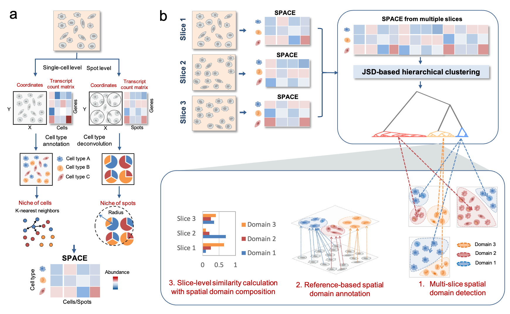

# SpaDo
Multi-slice **Spa**tial Transcriptome **Do**main Analysis.

<!-- -->
**Fig 1. Workflow of SpaDo.** **a.** Calculating the SPACE for both single-cell resolution and spot resolution spatial transcriptomic data. SPACE: SPatially Adjacent Cell type Embedding. **b.** Three functions involved in multi-slice spatial domain analysis: multi-slice domain detection, reference-based spatial domain annotation, and multi-slice clustering analysis by consideration of spatial domain composition. JSD, Jensen Shannon Divergence.
## Overview
With the rapid advancements in spatial transcriptome sequencing, multiple tissue slices are now available, enabling the integration and interpretation of spatial cellular landscapes. Herein, we introduce SpaDo, a concatenation-based tool for multi-slice spatial domain detection, annotation, and downstream analysis at both single-cell and spot resolutions. SpaDo includes modules for multi-slice spatial domain detection, reference-based annotation, and multi-slice clustering. We demonstrated SpaDo's effectiveness with over 40 multi-slice spatial transcriptome datasets from 7 sequencing platforms. Our findings highlight SpaDo's potential to reveal novel biological insights in multi-slice spatial transcriptomes.

## Installation
* **SpaDo** package can be installed from Github using **devtools** packages with **R>=4.0.5**.

    ```r
    library(devtools)
    install_github("bm2-lab/SpaDo")
    ```
    
## Getting started
See [Tutorials](https://www.jianguoyun.com/p/DW15NecQnMvoCxji45QFIAA) and [Demo datasets](https://www.jianguoyun.com/p/DX1ssBYQnMvoCxjZ45QFIAA)

## Citation
Bin Duan, Shaoqi Chen, Xiaojie Cheng, Qi Liu. Multi-slice Spatial Transcriptome Domain analysis with SpaDo.

