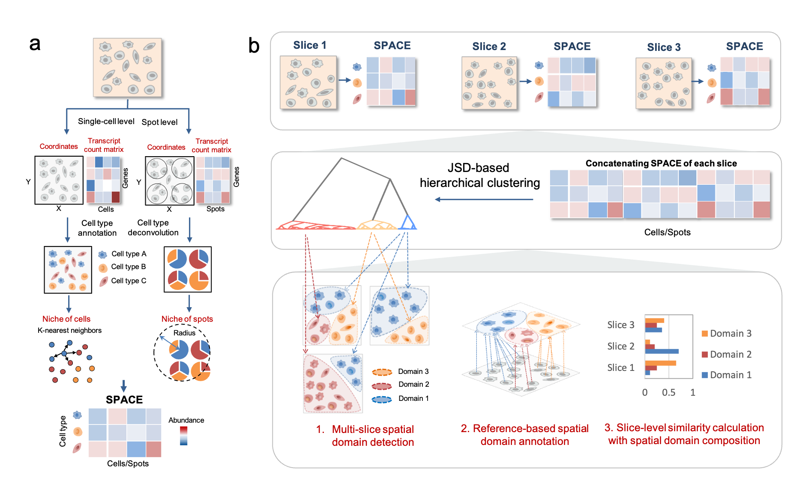

# SpaDo
Cross-slice **Spa**tial Transcriptome **Do**main Analysis.

<!-- -->
**Fig 1. Workflow of SpaDo.** **a.** Calculating the spatially adjacent cell type embedding for both single-cell resolution and spot resolution spatial transcriptomic data. SPACE, SPatially Adjacent Cell type Embedding. **b.** Three functions involved in multi-slice spatial domain analysis: multi-slice domain detection, reference-based spatial domain annotation, and slice-level clustering analysis with consideration of spatial domain composition. JSD, Jensen Shannon Divergence.

## Overview
In this study, we introduce SpaDo, an integrative tool that facilitates cross-slice spatial domain alignment, detection, annotation, and downstream analysis for spatial transcriptome at single-cell and spot resolutions. SpaDo encompasses the following functionalities: (1) spatial domain alignment and detection from multiple slices, (2) reference-based spatial domain annotation, and (3) slice-level clustering analysis.

## Installation
* **SpaDo** package can be installed from Github using **devtools** packages with **R>=4.0.5**.

    ```r
    library(devtools)
    install_github("bm2-lab/SpaDo")
    ```
    
## Getting started
See [Tutorials](https://www.jianguoyun.com/p/DW15NecQnMvoCxji45QFIAA) and [Demo datasets](https://www.jianguoyun.com/p/DX1ssBYQnMvoCxjZ45QFIAA)

## Citation
Bin Duan, Shaoqi Chen, Xiaojie Cheng, Qi Liu. Cross-slice Spatial Transcriptome Domain analysis with SpaDo.

